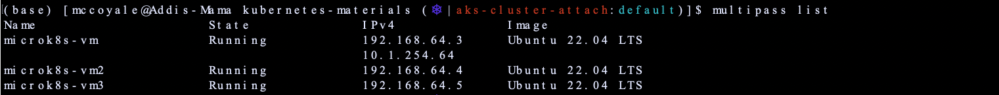

# Build a local Kubernetes Cluster with Multipass
[Multipass](https://multipass.run/) is a CLI tool, build by Canonical, in order to generate cloud-systel Ubuntu VMs on a Linux, MacOS or Windows machine. Depending on the size of the underlying infrastructure you can quickly build out a local mini-cloud. This is a great way to practice development with Kubernetes ecosystem on a budget. Other options include [AWS](https://portal.aws.amazon.com/billing/signup?refid=em_127222&redirect_url=https%3A%2F%2Faws.amazon.com%2Fregistration-confirmation#/start/email), [Azure](https://azure.microsoft.com/en-us/free/search/?ef_id=_k_CjwKCAiAjrarBhAWEiwA2qWdCPW1oFMX8yFDQGIUHnvArjt4XP_giNV0HIFIYAl0nSDK6Da6FIPcoxoC2V0QAvD_BwE_k_&OCID=AIDcmmfq865whp_SEM__k_CjwKCAiAjrarBhAWEiwA2qWdCPW1oFMX8yFDQGIUHnvArjt4XP_giNV0HIFIYAl0nSDK6Da6FIPcoxoC2V0QAvD_BwE_k_&gad_source=1&gclid=CjwKCAiAjrarBhAWEiwA2qWdCPW1oFMX8yFDQGIUHnvArjt4XP_giNV0HIFIYAl0nSDK6Da6FIPcoxoC2V0QAvD_BwE), [GCP](https://cloud.google.com/free?utm_source=google&utm_medium=cpc&utm_campaign=na-US-all-en-dr-bkws-all-all-trial-e-dr-1605212&utm_content=text-ad-none-any-DEV_c-CRE_665665924741-ADGP_Hybrid+%7C+BKWS+-+MIX+%7C+Txt_Google+Cloud+Free-KWID_43700077224933019-kwd-886545049102&utm_term=KW_gcp%20free%20account-ST_gcp+free+account&gad_source=1&gclid=CjwKCAiAjrarBhAWEiwA2qWdCD_OFhSy3ihdoKlgLzwWUXV81n_kRJJIXCae-v1ivhf_G92dckjlpxoCAIMQAvD_BwE&gclsrc=aw.ds), [IBM Cloud](https://cloud.ibm.com/registration) and a host of other platforms that you might otherwise have to pay for. My motto is do what is best for your learning experience!

## Multipass Installation
In my current setup, I am using MacOS on a M2 device. So understand that there may arise an instance where certain configurations or changes need to be made regarding your own setup. Follow the installation process for your workstation OS:

### MACOS 
The steps for MacOS were are listed under the assumption that you have [Brew installed](https://brew.sh/). If you do not, you can see what this package manager is about and download it to simplify your life. Thank me later! If you would rather use the install manager, then you can visit [this page](https://multipass.run/docs/installing-on-macos) for more guidance.

1. `brew install --cask multipass`

## MicroK8s Installation
For this scenario we are going to utilize MicroK8s for the Kubernetes installation. You can also use K3s or toy around with the lastest upstream Kubernetes release. For resource consumption purposes coupled with wanting something that maintains similar functionality to upstream Kubernetes releases, Microk8s was the best option.

```
1. Install Microk8s on your local workstation or operating system 
    // brew install ubuntu/microk8s/microk8s
2. Create a microk8s vm. You can also pass configuration options for cpu, memory, kubernetes versioning to this command. 
    // microk8s install
3. Confirm the status of the new microk8s VM
    // microk8s status 
```

### Windows OS
For Windows operating systems, you can view the following [document](https://microk8s.io/docs/install-windows) for installation. 

### Ubuntu Linux
For Ubuntu operating systems, you can use the following [document](https://microk8s.io/docs/getting-started) for installation. 

## Creating Your Multi-Node Cluster
During the Microk8s installation process we created a singular, or control plane node and/or multipass vm, which runs the Kubernetes services required to ensure our cluster is in a healthy state. If you run `multipass list` you should see VM instance display. We will use this instance as our control plane node. The cluster still requires additional instances, or worker nodes, to connect to the control plane node. 


1. Create two additional instances, or worker nodes, with the following commands. Feel free to modify resource limits to something appropriate for your work environment.

    `multipass launch --name microk8s-vm2 --cpus 1 --mem 2G --disk 10G`
    `multipass launch --name microk8s-vm3 --cpus 1 --mem 2G --disk 10G`



2. multipass shell microk8s-vm
    `sudo snap install multipass` // snap command is used to install software. Here we install multipass to connect nodes in the cluster later.
    `sudo usermod -a -G microk8s ubuntu` // add the ubuntu user to the microk8s group with appropriate permissions to run commands 
    `newgrp microk8s` // apply the changes and log the user into the group without having to log out of the shell 
    `sudo vi /etc/hosts` // modify the etc/hosts file to map the ip addresses to the domain names of the multipass VMs 
        // 192.168.64.3 microk8s-vm
        // 192.168.64.4 microk8s-vm2
        // 192.168.64.5 microk8s-vm3

3. multipass shell microk8s-vm2 //the same process on the worker nodes 
    `sudo snap install multipass`
    `sudo snap install microk8s --classic --channel=1.27/stable` // We install microk8s, as the main node was created with microk8s and multipass 
    `sudo usermod -a -G microk8s ubuntu`
    `newgrp microk8s`
    `sudo vi /etc/hosts`
        // 192.168.64.3 microk8s-vm
        // 192.168.64.4 microk8s-vm2
        // 192.168.64.5 microk8s-vm3

4. multipass shell microk8s-vm3 
    // Repeat the steps in step 2 on the remaining worker node

### Joining Your Nodes to Your Cluster
Now that we have created multiple VMs, which represents nodes, we need to join them together so that the orchestration layers is aware of what underlying infrastructure makes up the cluster, to deploy your containerized images to. For more information on this process or if you run into any issues, you can review the following [page](https://microk8s.io/docs/clustering). 

1. 


## Configuring Add-Ons for Your Cluster
Microk8s provides the ability to enable standard services to extend or add additional cloud native capabilities in your cluster. Follow the below steps to enable add-ons appropriate for your use case. 

1. You can view the following [link](https://microk8s.io/docs/addons) to determine the list of add-ons available or you can execute the following command to view the list in your terminal. 
    
    `microk8s status`
    
2. Run this command for each addon you would like to enable in your cluster. In this scenario we are enabling the DNS, Istio service, Kube Dashboard, and a private registry.
    
    `microk8s enable <addon>`

5. In order to disable addons run the following command below:
    
    `microk8s disable <addon>`

## Managing Your Cluster

## For Additional Help