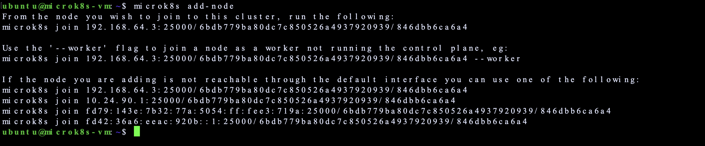
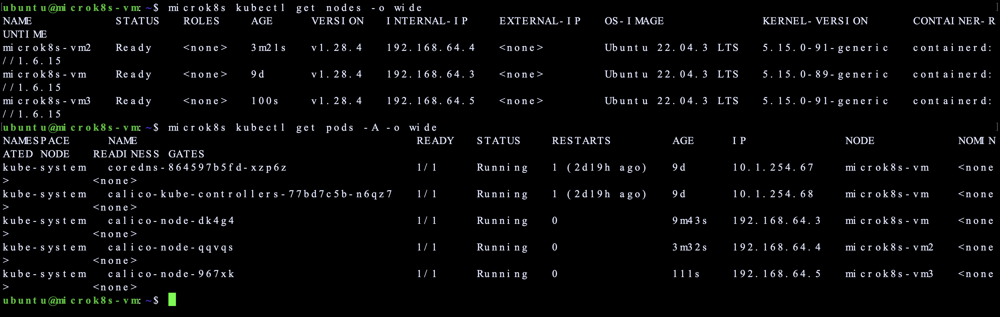
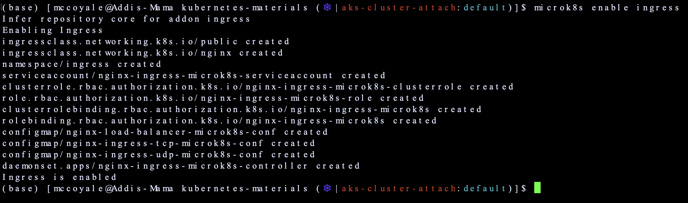
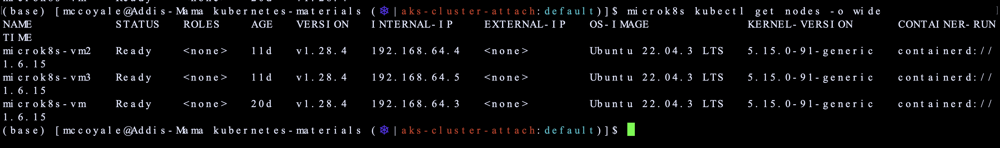

# Build a local Kubernetes Cluster with Multipass
[Multipass](https://multipass.run/) is a CLI tool, build by Canonical, in order to generate cloud-systel Ubuntu VMs on a Linux, MacOS or Windows machine. Depending on the size of the underlying infrastructure you can quickly build out a local mini-cloud. This is a great way to practice development with Kubernetes ecosystem on a budget. Other options include [AWS](https://portal.aws.amazon.com/billing/signup?refid=em_127222&redirect_url=https%3A%2F%2Faws.amazon.com%2Fregistration-confirmation#/start/email), [Azure](https://azure.microsoft.com/en-us/free/search/?ef_id=_k_CjwKCAiAjrarBhAWEiwA2qWdCPW1oFMX8yFDQGIUHnvArjt4XP_giNV0HIFIYAl0nSDK6Da6FIPcoxoC2V0QAvD_BwE_k_&OCID=AIDcmmfq865whp_SEM__k_CjwKCAiAjrarBhAWEiwA2qWdCPW1oFMX8yFDQGIUHnvArjt4XP_giNV0HIFIYAl0nSDK6Da6FIPcoxoC2V0QAvD_BwE_k_&gad_source=1&gclid=CjwKCAiAjrarBhAWEiwA2qWdCPW1oFMX8yFDQGIUHnvArjt4XP_giNV0HIFIYAl0nSDK6Da6FIPcoxoC2V0QAvD_BwE), [GCP](https://cloud.google.com/free?utm_source=google&utm_medium=cpc&utm_campaign=na-US-all-en-dr-bkws-all-all-trial-e-dr-1605212&utm_content=text-ad-none-any-DEV_c-CRE_665665924741-ADGP_Hybrid+%7C+BKWS+-+MIX+%7C+Txt_Google+Cloud+Free-KWID_43700077224933019-kwd-886545049102&utm_term=KW_gcp%20free%20account-ST_gcp+free+account&gad_source=1&gclid=CjwKCAiAjrarBhAWEiwA2qWdCD_OFhSy3ihdoKlgLzwWUXV81n_kRJJIXCae-v1ivhf_G92dckjlpxoCAIMQAvD_BwE&gclsrc=aw.ds), [IBM Cloud](https://cloud.ibm.com/registration) and a host of other platforms that you might otherwise have to pay for. My motto is do what is best for your learning experience!

## Multipass Installation
In my current setup, I am using MacOS on a M2 device. So understand that there may arise an instance where certain configurations or changes need to be made regarding your own setup. Follow the installation process for your workstation OS:

### MACOS 
The steps for MacOS were are listed under the assumption that you have [Brew installed](https://brew.sh/). If you do not, you can see what this package manager is about and download it to simplify your life. Thank me later! If you would rather use the install manager, then you can visit [this page](https://multipass.run/docs/installing-on-macos) for more guidance.

1. `brew install --cask multipass`

## MicroK8s Installation
For this scenario we are going to utilize MicroK8s for the Kubernetes installation. You can also use K3s or toy around with the lastest upstream Kubernetes release. For resource consumption purposes coupled with wanting something that maintains similar functionality to upstream Kubernetes releases, Microk8s was the best option.

### MAC OS
```
1. Install Microk8s on your local workstation or operating system 
    // brew install ubuntu/microk8s/microk8s
2. Create a microk8s vm. You can also pass configuration options for cpu, memory, kubernetes versioning to this command. 
    // microk8s install
3. Confirm the status of the new microk8s VM
    // microk8s status 
```

### Windows OS
For Windows operating systems, you can view the following [document](https://microk8s.io/docs/install-windows) for installation. 

### Ubuntu Linux
For Ubuntu operating systems, you can use the following [document](https://microk8s.io/docs/getting-started) for installation. 

## Creating Your Multi-Node Cluster
During the Microk8s installation process we created a singular, or control plane node and/or multipass vm, which runs the Kubernetes services required to ensure our cluster is in a healthy state. If you run `multipass list` you should see VM instance display. We will use this instance as our control plane node. The cluster still requires additional instances, or worker nodes, to connect to the control plane node. 


1. Create two additional instances, or worker nodes, with the following commands. Feel free to modify resource limits to something appropriate for your work environment.

    `multipass launch --name microk8s-vm2 --cpus 1 --mem 2G --disk 10G`
    `multipass launch --name microk8s-vm3 --cpus 1 --mem 2G --disk 10G`


2. Sehll into your control plane node in order to install multipass and microk8s on the cluster. 
    
    a. `multipass shell microk8s-vm`

    b. `sudo snap install multipass` // snap command is used to install software. Here we install multipass to connect nodes in the cluster later.

    c. `sudo usermod -a -G microk8s ubuntu` // add the ubuntu user to the microk8s group with appropriate permissions to run commands 

    d. `newgrp microk8s` // apply the changes and log the user into the group without having to log out of the shell 

    e. `sudo vi /etc/hosts` // modify the etc/hosts file to map the ip addresses to the domain names of the multipass VMs 

        // 192.168.64.3 microk8s-vm
        // 192.168.64.4 microk8s-vm2
        // 192.168.64.5 microk8s-vm3

3. multipass shell microk8s-vm2 //the same process on the worker nodes 

    a. `sudo snap install multipass`

    b. `sudo snap install microk8s --classic --channel=1.28/stable` // We install microk8s, as the main node was created with microk8s and multipass 

    c. `sudo usermod -a -G microk8s ubuntu`

    d. `newgrp microk8s`

    e. `sudo vi /etc/hosts`

        // m
        // 192.168.64.4 microk8s-vm2
        // 192.168.64.5 microk8s-vm3

4. multipass shell microk8s-vm3 

    // Repeat the steps in step 2 on the remaining worker node

### Joining Your Nodes to Your Cluster
Now that we have created multiple VMs, which represents nodes, we need to join them together so that the orchestration layers is aware of what underlying infrastructure makes up the cluster, to deploy your containerized images to. For more information on this process or if you run into any issues, you can review the following [page](https://microk8s.io/docs/clustering). 

1. You will need to join the nodes by first generating a token on the control-plan node. In order to do so, shell into the control plane node:
    
    a. `multipass shell microk8s-vm`

2. On the control-plane node run the following command for token retrieval:

    a. `microk8s add-node`

3. Shell into the first work node using the command from step 1 of this section, and run the command provided in step 2. Ensure that you use the correct command, as the first is for an additional control-plane node and the second is for a worker node.

    a. `microk8s join 192.168.64.3:25000/ab457d9a2933d63e17db7a738a17135f/846dbb6ca6a4 --worker`

    b. Complete the same steps for each node that you are adding to the cluster. The setup required me to run the add-node command for each node that I was adding to the cluster verse reusing a command. This was due to not being able to reuse the same token.

    

4. Confirm that your nodes and running pods are running in a healthy state by running the following commands:

    a. `microk8s kubectl get nodes -o wide` followed by  `microk8s kubectl get pods -A -o wide`

    


## Configuring Add-Ons for Your Cluster
Microk8s provides the ability to enable standard services to extend or add additional cloud native capabilities in your cluster. Follow the below steps to enable add-ons appropriate for your use case. 

1. You can view the following [link](https://microk8s.io/docs/addons) to determine the list of add-ons available or you can execute the following command to view the list in your terminal. 
    
    `microk8s status`
    
2. Run this command for each addon you would like to enable in your cluster. In this scenario we are enabling the DNS, Istio service, Kube Dashboard, and a private registry.
    
    `microk8s enable <addon>`

5. In order to disable addons run the following command below:
    
    `microk8s disable <addon>`

By default, the dns addon is configured for networking management. This is how your nodes and applications deployed in the cluster know how to communicate with one another and where to route external traffic. 

6. Since I am using this cluster for studying purposes, we will enable the [ingress](https://kubernetes.io/docs/concepts/services-networking/ingress/) addon for additional networking functionality. 

    `microk8s enable ingress`

We see in the below capture additional yaml files from some remote repository are applied and deployed to the cluster. 



The standard cluster setup or configuration allows for you to interact with your cluster via your local workstation. However, if you would like to work from a node within the cluster, then you can shell into the VM using the `shell` command from Step 1 of the join nodes to your cluster section. 

In addition, some cloud providers offer what's called a [`bastion host`](https://en.wikipedia.org/wiki/Bastion_host). Which is a VM or computer that is configured on the network to access to the cluster in a secure way. It is not a node within your cluster and typically hosts a single process such a load balancer to protect the cluster from outside or less secure traffic. In a production environment this is ideal, but for testing purposes now...not so much!

## Deploy A Workload to Test
In order to test whether or not our cluster is ready to accept and run scheduled workloads we will need to deploy a simple application to the cluster. 

1. Let's check and ensure our cluster is in a healthy state and networking configuration working:

    `microk8s kubectl get nodes`

In the screen capture below `-o wide` flag is appended to the above command to visualize additional configuration options for the node. We can see that we are using Ubuntu Linux as the OS image with a kernel version of 5.15. In addition, the cluster is using [containerd](https://containerd.io/) as the [container runtime](https://kubernetes.io/docs/setup/production-environment/container-runtimes/). Containerd is a [CNCF](https://www.cncf.io/projects/) solution and standard runtime within the industry. 



2. Create a Namespace to deploy your workload to

    `microk8s kubectl create ns ingress-test`

Note: Two things to note here, I am using an alias since the microk8s kubectl command is too long. You can create one for yourself using the command below.

`alias mk='microk8s kubectl'`

3. Deploy a test deployment to your cluster:

    `mk create deployment ing-test --image=httpd --port=80`

4. Use the below command to expose your test application:

    `mk expose deployment ing-test`

5. You can then use the following command to deploy and ingress resource in the cluster. 

    `mk create -f multipass-yaml/local-ingress.yaml` //this will apply the yaml file from this specific repository

4. We can test traffic to the deployment at various levels:

    a. Let's first exec into the pod and run a curl command to confirm the output we should receive.

        i. `mk exec -it ing-test-697896dff-nh9zk -- /bin/bash`
        ii. `curl localhost:8080`

    *Note: I needed to change the port from 80 to 8080 due to something internally utilizing this port and displaying succesful attempts that should have failed.* 

    b. You can also curl the pod from your local workstation:

        i. `mk port-forward pod/ing-test-697896dff-429n6 8080:80` // this forwards port 80 in the container to port 8080 on your localhost

    c. We can then curl the service to ensure that we receive the same response, while shelled into a node or on your local host. You will need to retrieve the IP and Port address from the service created in step 4. 

        i. `curl 10.152.183.164:80` // this is the IP address assigned to the service and the port it has configured.

5. We now need to confirm that our ingress setup is working and accepting traffic.

    a. 

## Troubleshooting
This section outlines some issues and their respective resolutions that occurred during following these steps for the initial deployment. If you encounter anything different, feel free to submit an issue to this repository along with the resolution steps. 

### Calico Networking Deployment Failed
Initially creating the cluster, Calico networking experience authentication issues resulting in ingress pods and newly created pods unsucessifully deploying. More information on this can be viewed in issue [#7](https://github.com/McCoyAle/kubernetes-materials/issues/7)

## For Additional Help
For additional information, use cases, or if you are simply looking to enhance the capabilities of your cluster you can have a look at some of the links listed below. Most of the products associated with this setup have friendly communities and quality documentation. 

1. [Kubernetes Documentation](https://kubernetes.io/docs/home/)
The latest versions of Kubernetes list [`kubeadm`](https://kubernetes.io/docs/setup/production-environment/tools/kubeadm/) as the standard for deploying kubernetes clusters. Likely, you can configure multipass VMs and utilize kubeadm in order to create and configure your cluster. It's your world!

2. [MicroK8s Documenation](https://microk8s.io/docs)
Microk8s is consider as a version of Kubernetes that consumes less resources. Therefore, if you are not working on actual servers or VMs and want to achieve the same outcome without utilizing resources it is ideal.

In addition, there is also [K3s](https://k3s.io/) which is also another lightweight solution for deploying Kubernetes clusters. 

3. [Multipass Documentation](https://multipass.run/)
Multipass is a tool for deploying Ubuntu VM instances using [cloud-init](https://cloud-init.io/). If you have a single VM or computer it is ideal for isolating local resources in a way that creates multiple local instances to cluster. 
